# Laboratorio de inventos

Tres inventos y un juego para niños y niñas con una placa **NodeMCU
(ESP8266)**, de la familia de herramientas **zlecitool** de **tuisku**
([tuisku.eu](https://tuisku.eu)): un **semáforo**, un **sonómetro**, un
**detector de fantasmas** (cada uno con sus juegos) y **¡Salta, Chispa!**, un
juego de correr y saltar que se juega con la placa, solo o de dos en dos. Todo se maneja desde el móvil, la tableta o el ordenador, y se
**programa con bloques, como en Scratch**. La web vive dentro de la placa: no
hace falta internet, ni cuentas, ni instalar nada.

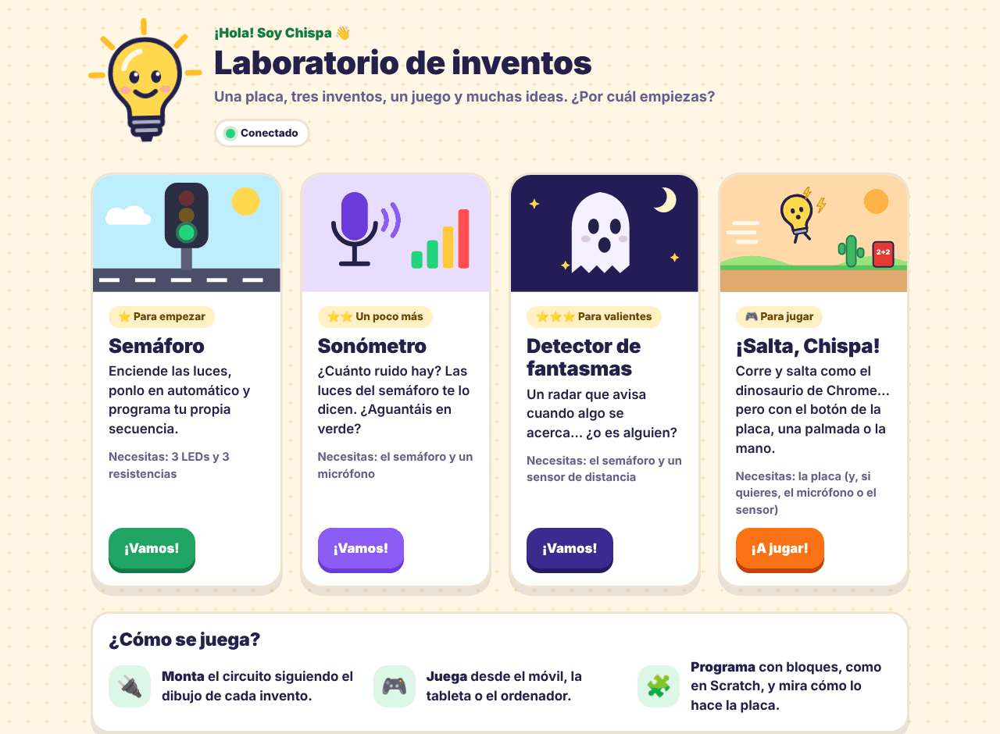

*La portada, tal como la sirve la placa en su propia wifi. Chispa, la
bombilla, es la mascota. Toda la web (87 kB comprimidos) está dentro del
firmware.*

Este README va con la versión **1.2.1** (ver [CHANGELOG.md](CHANGELOG.md)).
Hoy el Laboratorio funciona solo, sin el núcleo `zlecitool-core`; cómo
entraría en la plataforma está en [docs/PLATAFORMA.md](docs/PLATAFORMA.md).

| Documento | Para quién |
|---|---|
| [docs/PLATAFORMA.md](docs/PLATAFORMA.md) | Quien lo vaya a meter en tuisku: qué se queda en la placa, qué iría a una herramienta `lab` y qué pone ya el núcleo (cuentas, colegios, máquinas, IA). |
| [docs/BLOQUES.md](docs/BLOQUES.md) | Quien quiera programarla con bloques o con otra herramienta (TurboWarp, Snap!, MicroBlocks…). |
| [docs/NUEVO_INVENTO.md](docs/NUEVO_INVENTO.md) | Quien añada un invento: pines, firmware, simulador y web. |
| [docs/handoff/](docs/handoff/) | Quien traiga un diseño nuevo: cada export de Claude Design, tal cual, con su `CAMBIOS.md` (qué se aplica y qué se queda como está en la app). |
| [CHANGELOG.md](CHANGELOG.md) | Qué trae cada versión. |
| [CLAUDE.md](CLAUDE.md) | Las reglas para trabajar en este repo, también para la IA. |

## Qué hace, pieza a pieza

Cada invento, y también el juego, tiene tres pestañas: **Jugar**,
**Programar** (con cinco o seis retos) y **Montar** (con el dibujo de los
cables). En cada pieza, «Se monta» dice lo
que hay que conectar a la placa. Todo vive a la vez en la misma placa y con
las mismas tres luces: se monta una vez y se pasa de un invento a otro sin
desmontar nada.

**Todos los juegos**, cada uno con su captura más abajo:

| Juego | Dónde | Se juega con |
|---|---|---|
| 🎮 ¡Salta, Chispa! (uno o dos jugadores) | [su página](#-salta-chispa) | el botón FLASH, una palmada o la mano; o tocando la pantalla |
| 🟢🔴 Luz roja, luz verde | [el semáforo](#-el-semáforo) | el sensor de distancia: tú eres la ficha |
| 🤫 Reto del silencio | [el sonómetro](#-el-sonómetro) | el micrófono: diez segundos sin llegar al amarillo |
| 👏 Récord de palmada | [el sonómetro](#-el-sonómetro) | el micrófono |
| ⚔️ Duelo de palmadas | [el sonómetro](#-el-sonómetro) | el micrófono, por equipos |
| 👻 Cazar fantasmas | [el detector](#-el-detector-de-fantasmas) | el sensor de distancia: la mano, hasta el 5 |
| ⏱ Caza contrarreloj | [el detector](#-el-detector-de-fantasmas) | el sensor de distancia, durante un minuto |

### 🚦 El semáforo

Las luces de la pantalla son las de verdad: se tocan y se encienden en la
placa. Tres modos: **Yo** (a mano), **Automático** (verde, amarillo, rojo, a
tres velocidades) y **Noche** (el amarillo parpadea). En automático, «Quiero
cruzar» (o el botón FLASH de la placa) adelanta el rojo, el semáforo de
peatones se pone verde y el zumbador pita para quien no ve.

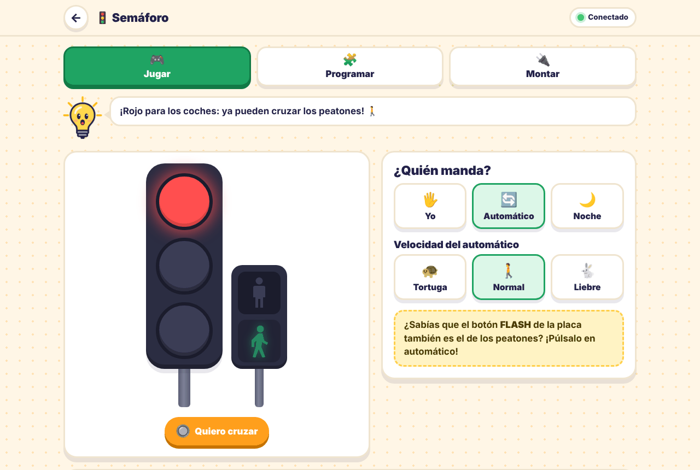

Y debajo, un juego para moverse: **🟢🔴 Luz roja, luz verde**. Se empieza a más de
40 cm de la placa; en verde se avanza hacia ella y en rojo, ¡quieto! El sensor
de distancia hace de árbitro: si en rojo te mueves más de 6 cm, vuelta a la
salida. Gana quien llega a 12 cm, y el mejor tiempo queda de récord.

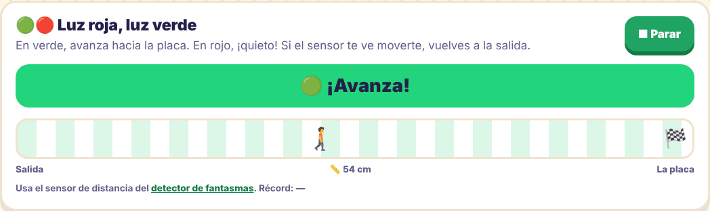

**Se monta:** tres LEDs, cada uno con su resistencia de 220 Ω, en D5 (rojo),
D6 (amarillo) y D7 (verde); el zumbador en D8, si se quiere sonido. El botón
de peatones ya está en la placa. Para «Luz roja, luz verde», el sensor de
distancia del detector de fantasmas.

### 🧩 Programar con bloques

Los bloques se tocan (o se arrastran) para hacer una secuencia, y
**▶ ¡Ejecutar!** la recorre paso a paso: la placa hace cada cosa y el bloque
que va por ahí brilla, como en Scratch. Por familias y con sus colores:
💡 luces (encender, apagar, apagar todas), 🔊 sonido (pitar, tocar una nota),
🔁 control (esperar, repetir, por siempre) y 📡 sensores (esperar a que pulsen
el botón, a que haya ruido o a que algo se acerque; «si el ruido es…», «si
algo está a menos de…»). Los bucles dicen por qué vuelta van; lo que nunca
llegará a ejecutarse (debajo de un «por siempre») sale en gris. Cada invento
enseña sus bloques, trae un ejemplo y sus retos con estrellas. En el juego
hay además ⚡ eventos, «cuando Chispa salte, choque, coja un rayo…», que
esperan cada uno por su cuenta a la vez que el resto del programa. El
programa se guarda en el navegador.

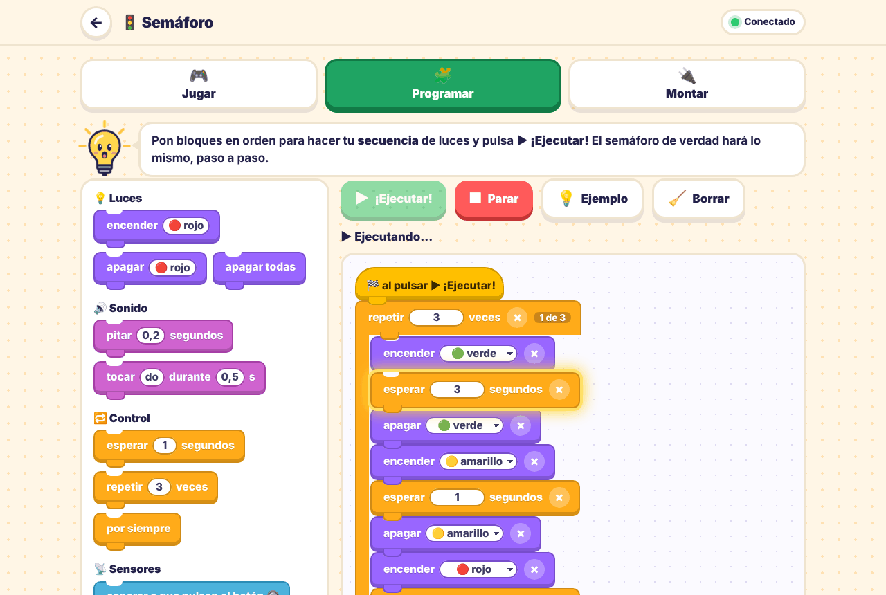

**Se monta:** nada más; se programa lo que haya montado.

### 🎤 El sonómetro

Una aguja de 0 a 100 (como los decibelios: el oído va a saltos), la cara de
Chispa, una gráfica de los últimos 30 segundos y, en la placa, las luces del
semáforo: verde, amarillo o rojo según el ruido. Los colores y la
sensibilidad se ajustan con deslizadores. Tres juegos: el **reto del
silencio** (diez segundos sin llegar al amarillo), el **récord de palmada** y
el **⚔️ duelo de palmadas**: dos equipos se turnan para dar la palmada más
fuerte, a tres rondas, y la luz de la placa dice quién va ganando (amarilla
si hay empate). La placa guarda dos segundos el pico de cada palmada, así que
en el duelo cuenta aunque sea cortísima (la de antes del «¡AHORA!», no).

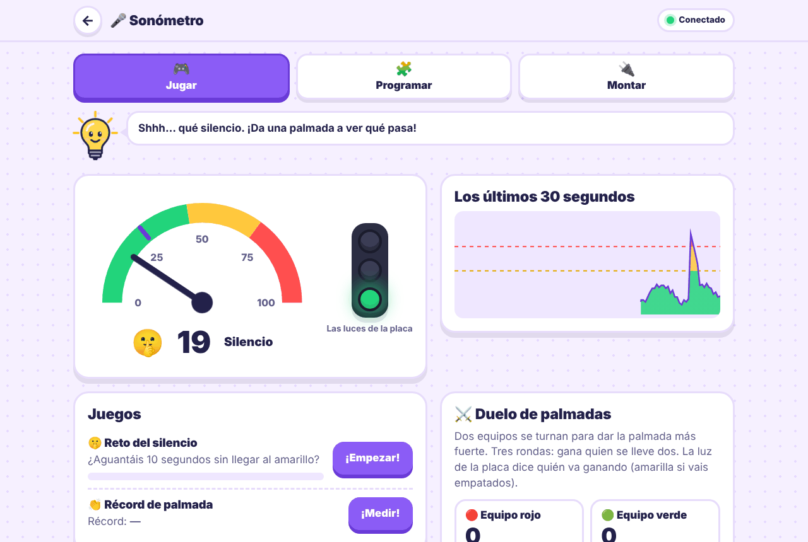

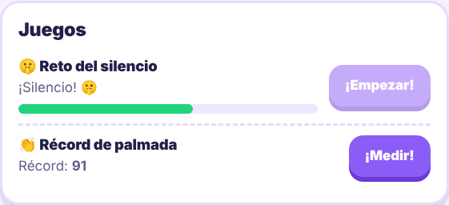

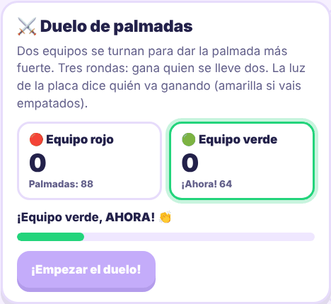

**Se monta:** un micrófono con amplificador (MAX4466 o MAX9814; también valen
los KY-038, que oyen menos): OUT en A0, VCC en 3V3 y GND en GND.

### 👻 El detector de fantasmas

Un radar de ultrasonidos: cuanto más cerca está algo, más **energía
espectral** (de 0 a 5), más se deja ver el fantasma y más deprisa pita la
placa. A 5, «¡BUUU!» y un fantasma cazado (con su flash). Las distancias de
«cerca» y «lejos» se ajustan. En la **⏱ caza contrarreloj** hay un minuto para
cazar todos los que se pueda, con el reloj y el marcador encima del radar;
al acabar, el reloj se queda cuatro segundos con el resultado y se va.

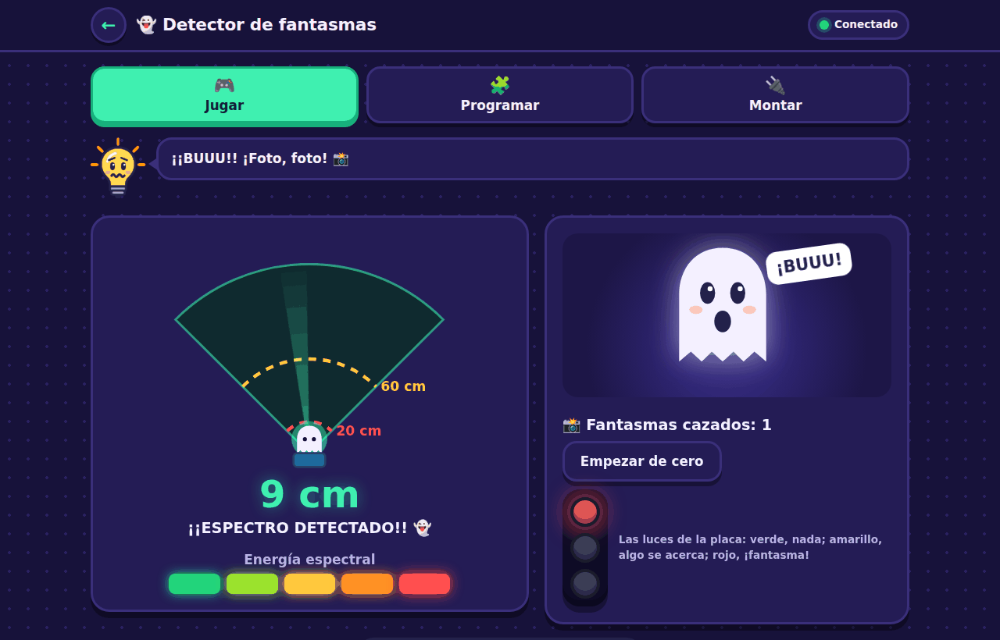

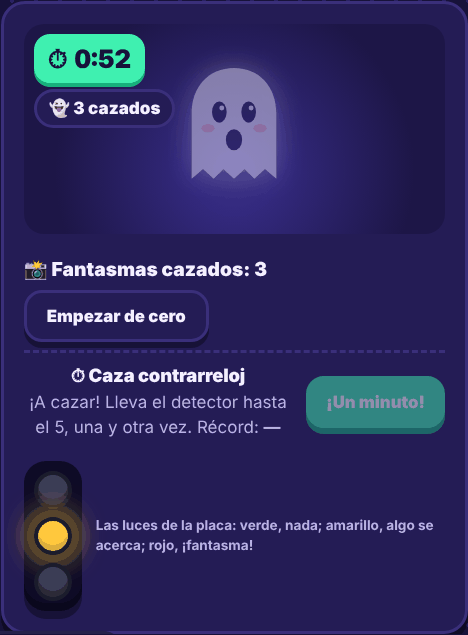

**Se monta:** un sensor HC-SR04: VCC en VIN (5 V), GND en GND, TRIG en D1 y
ECHO en D2 pasando por una resistencia de 1 kΩ, con otra de 2 kΩ de D2 a GND
(el ECHO da 5 V y la placa aguanta 3,3 V). Con un HC-SR04P no hacen falta:
VCC en 3V3 y ECHO directo a D2.

### 🎮 ¡Salta, Chispa!

Como el dinosaurio de Chrome cuando no hay internet, pero con Chispa, dibujos
de colores, día y noche, y **mandos de verdad**: el **botón FLASH** de la
placa, una **palmada** o la **mano** a menos de 15 cm del sensor (y siempre
tocando la pantalla o con la barra espaciadora). Con la mano entre 15 y 30 cm
(o la flecha ↓, o «Agáchate»), Chispa **se agacha** y el examen volador le
pasa por encima (también se puede saltar). Salen cosas que no apetecen: cactus, deberes, brócoli, el
libro de mates, un coche con prisa y el **Nubarrón**, que tira exámenes desde
arriba. Ayudan tres poderes (escudo, cohete y cámara lenta) y hay rayos para
coger; tres vidas, o cinco en **🐢 modo tortuga**, que va más despacio.
Mientras nadie juega, la pantalla de inicio juega sola. Las luces de la placa
van con la partida: verde corriendo, amarillo con un poder, rojo al chocar.

- **Tres mundos:** el campo 🌵, la granja 🐔 y la luna 🌙, donde se salta más
  alto. Cada uno tiene sus obstáculos, y ganar uno abre el siguiente.
- **El final, por fases.** A los 800 m llega la **Súper Cosechadora**: primero
  tira pacas de paja, luego pide tres saltos seguidos y al final sólo se salta
  con el cohete. Al ganar, de una a tres estrellas según los rayos cogidos.
- **Dos jugadores**, con la pantalla partida: el 1 salta con el botón (o la
  tecla A) y el 2 con palmadas (o la L). Gana quien llegue más lejos.
- **Récords de la clase:** quien entra entre los cinco mejores pone un alias
  (nunca el nombre de verdad), y la placa los guarda en su memoria flash: se
  ven desde cualquier tableta y duran aunque se desenchufe.
- **Para coleccionar:** los rayos de todas las partidas abren **colores de
  Chispa**, y hay **nueve pegatinas** que ganar.
- **Se programa:** con bloques «⚡ cuando…», por ejemplo que la luz verde se
  encienda en cada salto y la roja pite en cada choque.

<p>
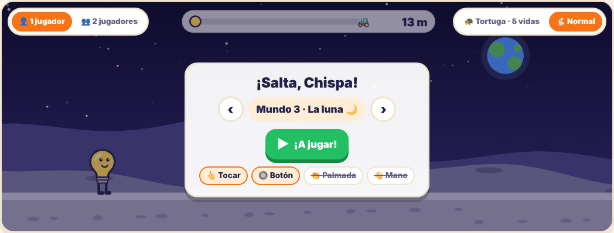
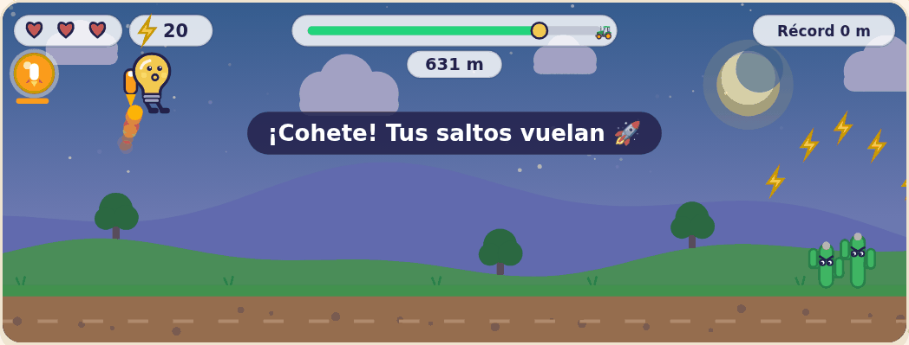
</p>
<p>
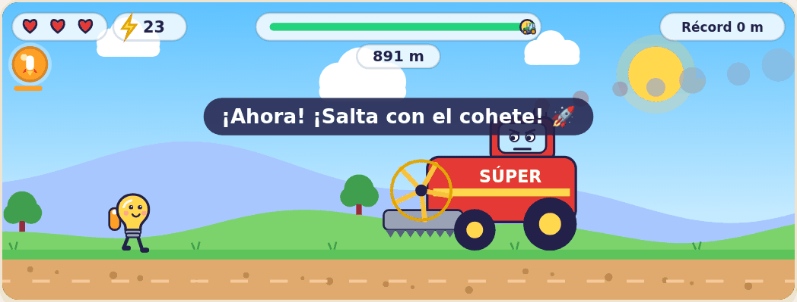
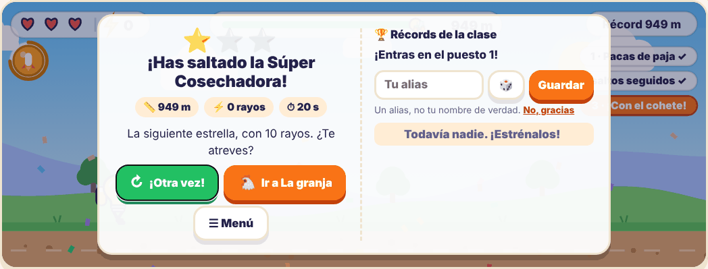
</p>
<p>
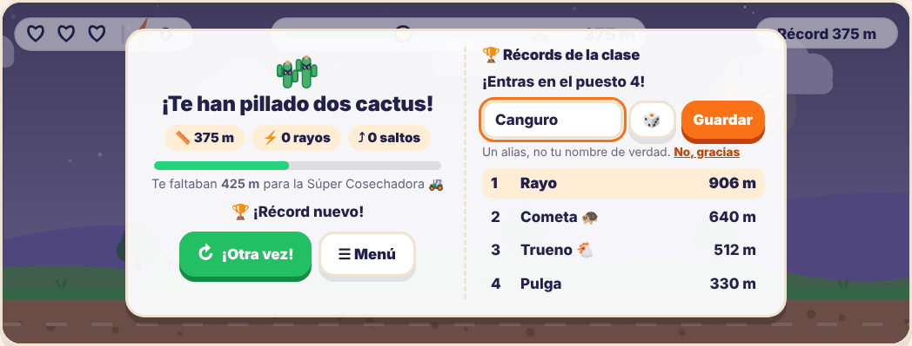
</p>
<p>
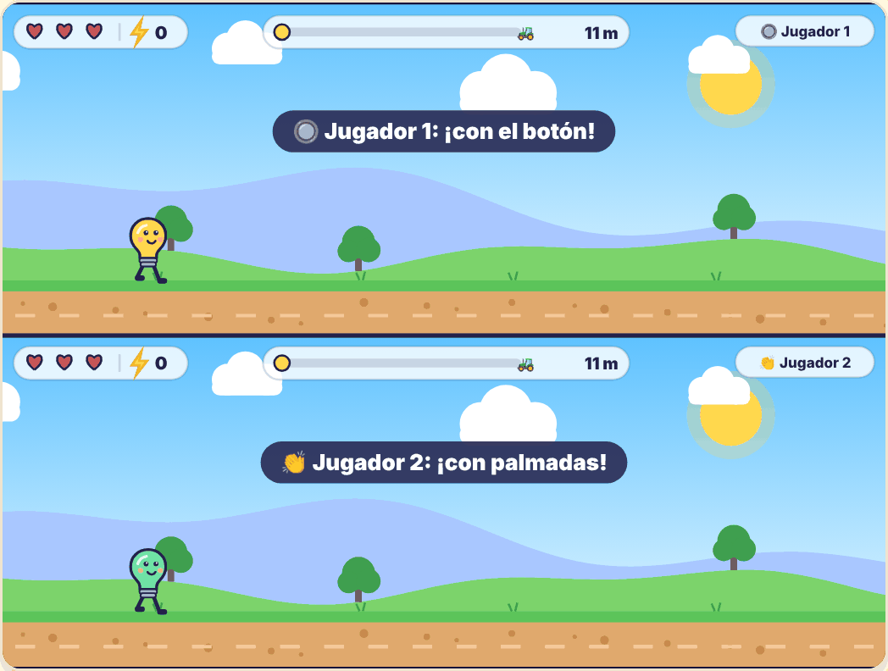
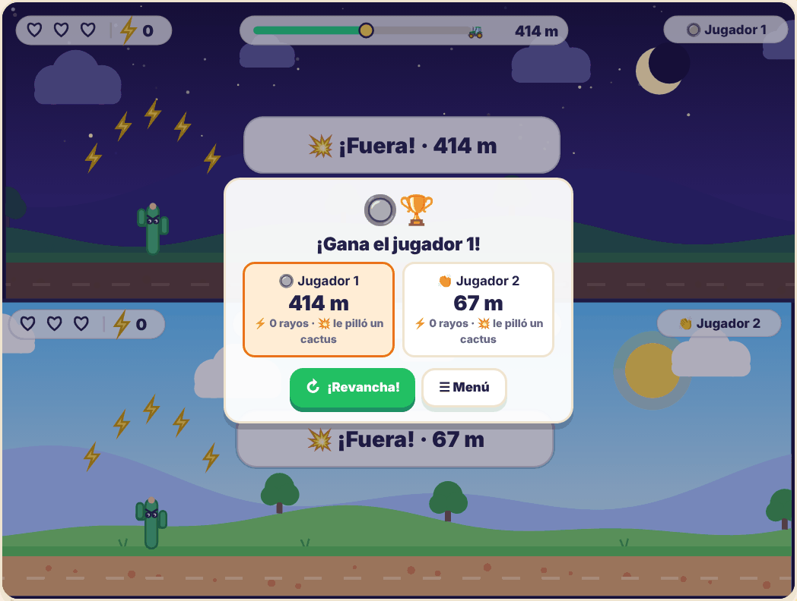
</p>

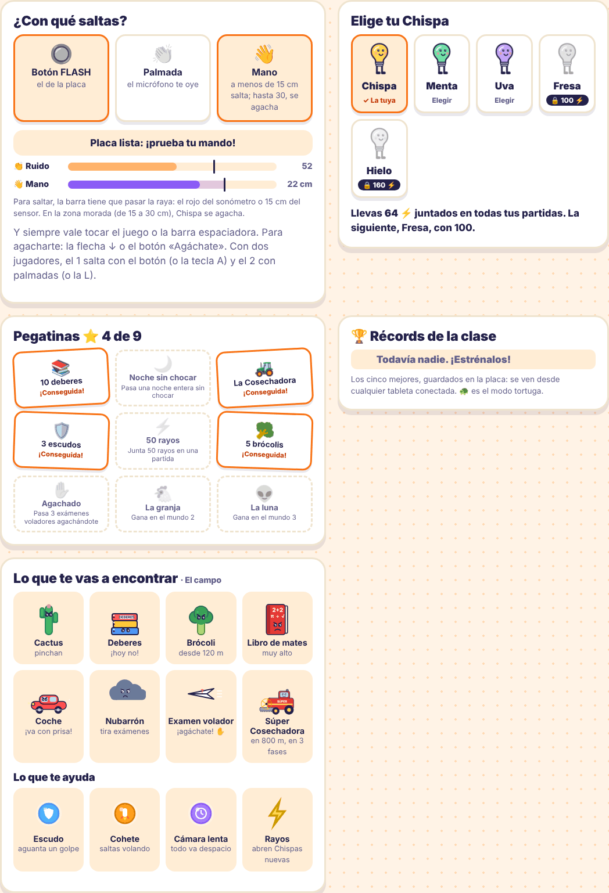

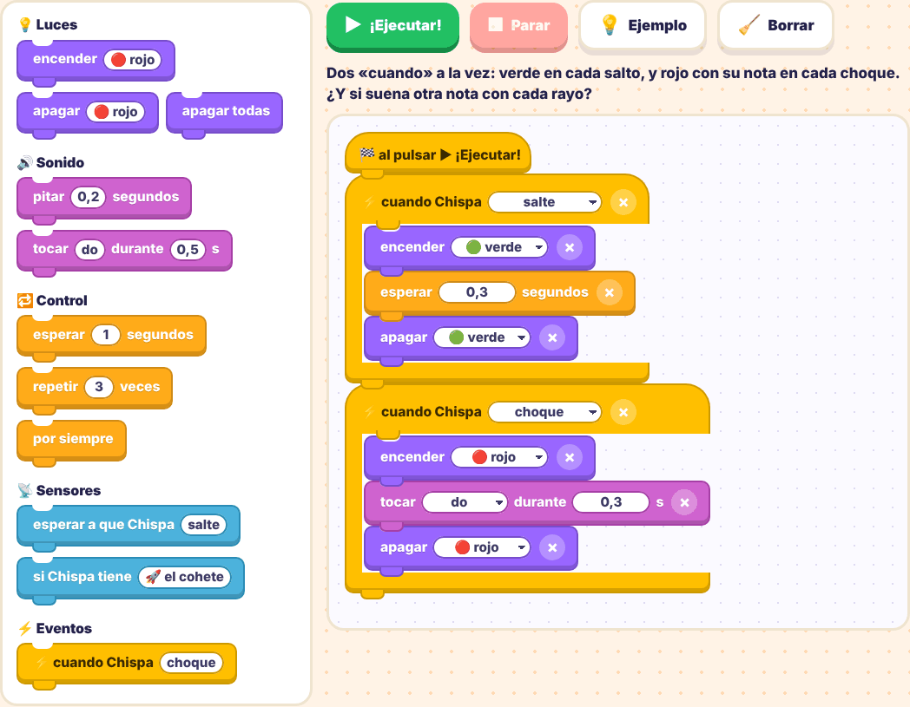

**Se monta:** nada para el botón. Para la palmada, el micrófono del
sonómetro; para la mano, el sensor del detector.

### 🔌 Montar

Cada invento trae su lista de piezas, el **esquema** de la NodeMCU con sus
pines de verdad (lo de ese invento en color; lo de los otros, en gris), la
tabla de qué pata va a qué pin y los pasos, con lo que hay que saber (la pata
larga del LED, para qué la resistencia). Al arrancar, cada luz se enciende con
su nota (do, mi, sol): si una no lo hace, ese LED está del revés.

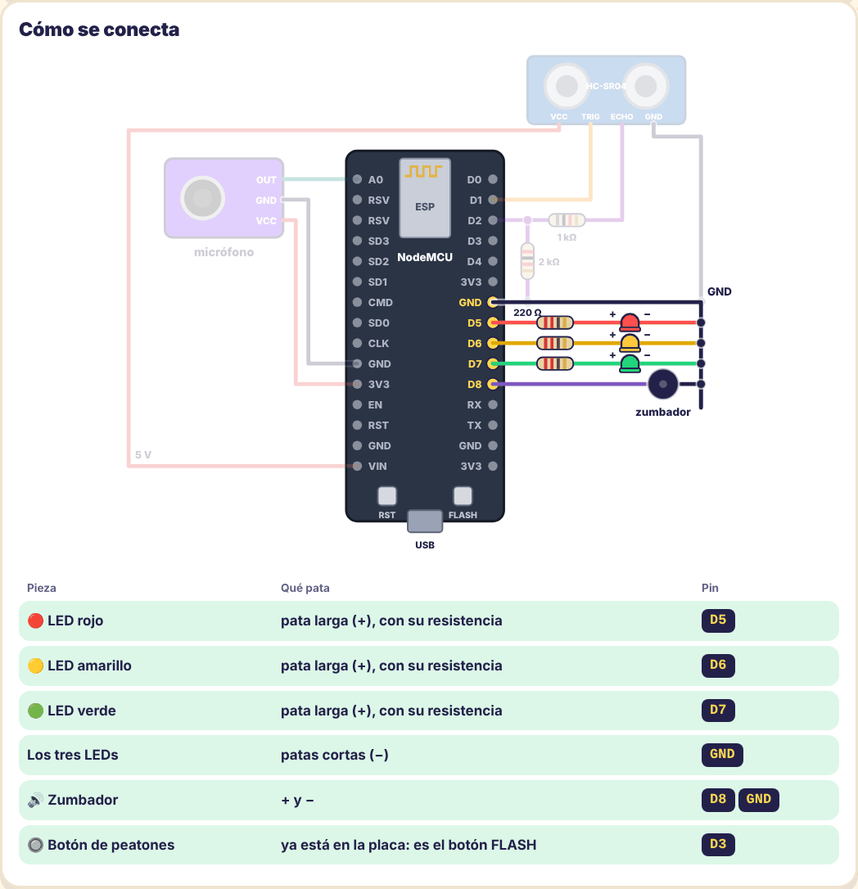

**Se monta:** lo que diga cada invento. El esquema completo, abajo
([Cómo se monta](#cómo-se-monta)).

### 📶 La wifi de la placa

La placa crea su wifi, **Laboratorio-XXXX** (las cuatro letras salen de cada
placa: en una clase con varias no se mezclan), sin contraseña o con la de
`config.h`. Es un **portal cautivo**: al conectarse, el móvil abre la web
solo, como en la wifi de un hotel; si no, `http://192.168.4.1` o
`http://laboratorio.local`. También puede entrar en la wifi de casa
(`config.h`); si no lo consigue en 15 segundos, crea la suya.

**En clase, una placa por grupo.** Su wifi admite **8 aparatos** como mucho
(es lo más que deja el chip: el noveno no entra), y va más suelta con 4 a 6.
Todos manejan las mismas luces, así que cada placa hace un invento a la vez.
Con más aparatos, mejor la wifi de un router (`config.h`): ahí el límite de 8
desaparece, aunque la placa sigue contestando de uno en uno.

**Se monta:** nada.

### 📱 En el móvil

Todo se adapta a un móvil de 360 px y a las tabletas: la paleta de bloques
enseña una familia cada vez y se queda arriba mientras se baja por el
programa; el esquema se desliza de lado; el juego pide girar el móvil.

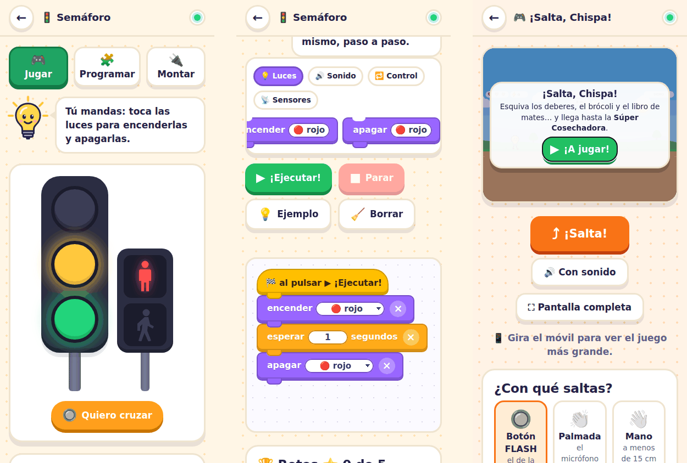

### Lo que no se ve

- **Sin librerías:** el firmware sólo usa lo que trae el núcleo ESP8266
  (`ESP8266WebServer`, `DNSServer`, `ESP8266mDNS`): cargarlo es abrir el
  `.ino` y pulsar «Subir». Compila con la 3.1.2 y con la 2.7.4.
- **La web, dentro del firmware:** se escribe en `web/` como ficheros normales
  y `tools/build_web.py` la comprime (303 kB → 87 kB) en
  `laboratorio/web_pages.h`, con su ETag (el móvil no la vuelve a bajar si no
  ha cambiado). Nada viene de internet: ni fuentes ni librerías.
- **Las palmadas,** en cada lectura del micrófono (no cada 150 ms): en el
  juego, saltar tarde es chocar.
- **Los récords de la clase, en la flash:** en la «EEPROM» que trae el núcleo
  ESP8266 (sin librerías aparte). Sólo se escribe cuando alguien entra entre
  los cinco. El alias se limpia en la placa (sin `<>"&`, 12 letras como
  mucho, contando bien la «ñ» y los emojis), y se borran con
  `/api/records?clear=1`.
- **El simulador** (`tools/simulador.py`): la misma lógica que el firmware, en
  Python, con un micrófono y un sensor de mentira. Sirve para tocar la web sin
  placa y para las pruebas.
- **Las pruebas:** 163, con pytest y Chromium: que el firmware, el simulador y
  la web dicen lo mismo (las órdenes, la forma del estado, los ajustes; el
  alias de los récords se compara compilando el del firmware), los bloques
  ejecutándose (también los «⚡ cuando…» a la vez), el juego con cada mando y
  cada idea nueva (dos jugadores, mundos, tortuga, agacharse, récords,
  pegatinas, el final por fases), los juegos de cada invento, y que nada se
  sale de un móvil de 360 px.
- **La API,** para programarla desde fuera ([abajo](#la-api)).

## Cómo se monta

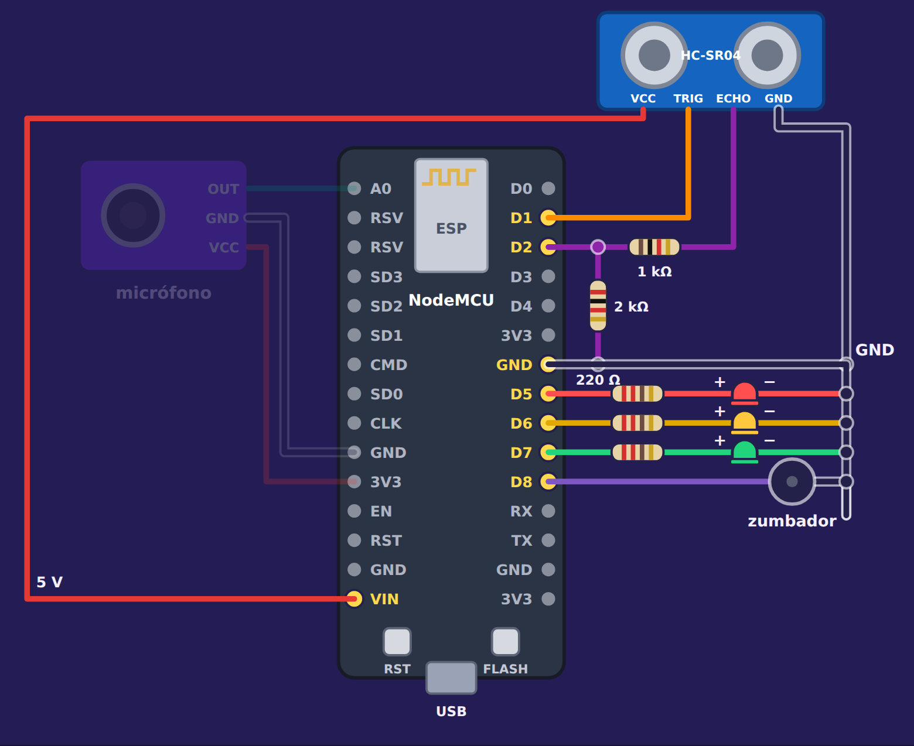

| Pieza | Pata | Pin de la NodeMCU |
|---|---|---|
| 🔴 LED rojo / 🟡 amarillo / 🟢 verde | pata larga (+), cada una con su resistencia de 220 Ω | **D5** / **D6** / **D7** |
| Los tres LEDs | patas cortas (−) | **GND** |
| 🔊 Zumbador pasivo (opcional), mejor piezoeléctrico | + / − | **D8** / **GND** |
| 🎤 Micrófono (MAX4466, MAX9814, KY-038…) | OUT (o AO) / VCC / GND | **A0** / **3V3** / **GND** |
| 👻 Sensor HC-SR04 | VCC / GND / TRIG | **VIN** (5 V) / **GND** / **D1** |
| 👻 Sensor HC-SR04 | ECHO, por una resistencia de 1 kΩ (y otra de 2 kΩ de D2 a GND) | **D2** |
| 🔘 Botón de peatones y del juego | ya viene en la NodeMCU: el botón **FLASH** (en una Wemos D1 mini, un pulsador entre D3 y GND) | D3 |

Siempre **con la placa desenchufada** al cambiar cables. Los pines se cambian
en [`laboratorio/config.h`](laboratorio/config.h); la chuleta de la placa, en
[docs/img/nodemcu-pinout.jpg](docs/img/nodemcu-pinout.jpg).

Del zumbador: uno **piezoeléctrico** va directo a D8. Uno de bobina (los
magnéticos) pide más corriente de la que da un pin, y un módulo de tres patas
con transistor puede tener D8 en alto al arrancar, y entonces la placa no
arranca.

### ¿En qué placa va?

En un **ESP8266** con los pines de la NodeMCU. El firmware ocupa poco: 395 kB
de su mega de programa (37 %), 32 kB de RAM (39 %; del Laboratorio, unos 4
kB: el resto es la wifi del núcleo) y la web, 87 kB comprimidos que se mandan
desde la flash a trozos, sin gastar RAM. Al arrancar quedan unos 49 kB para la
wifi y las conexiones.
El «94 %» de IRAM que dice el compilador cuenta también los 32 kB de caché: de
código de verdad quedan 3,8 kB, casi todo del núcleo.

| Placa | ¿Va? | Lo que hay que saber |
|---|---|---|
| **NodeMCU v2 o v3** (ESP-12E/F, 4 MB) | Sí, tal cual | La de este README. Placa en el IDE: «NodeMCU 1.0 (ESP-12E Module)». |
| **Wemos / LOLIN D1 mini** (4 MB) | Sí, el mismo firmware | No trae botón FLASH: un pulsador entre D3 y GND. Su pin «5V» hace de VIN. Placa: «LOLIN(WEMOS) D1 R2 & mini». |
| **ESP-12E/F suelto** | Sí, con su circuito | Hay que ponerle lo que trae la NodeMCU: regulador de 3,3 V, resistencias en EN, RST, GPIO0 y GPIO15, adaptador USB-serie y un divisor en A0 (el chip sólo lee hasta 1 V; sin él, el micrófono satura). |
| **Wemos D1 R1** (con forma de Arduino Uno) | No sin cambios | Compila, pero sus D1…D8 son otros pines: D1 es el TX y D8, un pin de arranque. |
| **ESP-01 / ESP-01S** | No | Sólo cuatro pines y ninguno analógico: no caben las luces, el sensor y el micrófono. |

Compilado con el núcleo ESP8266 3.1.2 para la NodeMCU 1.0 y 0.9, la D1 mini,
la D1 mini Lite (1 MB) y la D1 mini Pro: el mismo tamaño en todas. Con la
placa «Generic ESP8266 Module» se para a propósito (`config.h`), porque esa
no tiene los nombres D1…D8.

## Cargar la placa

1. En el **IDE de Arduino**, *Preferencias → URLs adicionales del gestor de
   placas*: `https://arduino.esp8266.com/stable/package_esp8266com_index.json`.
   En el *Gestor de placas*, **esp8266** (3.1.2; también vale la 2.7.4).
2. Abrir [`laboratorio/laboratorio.ino`](laboratorio/laboratorio.ino), elegir
   **NodeMCU 1.0 (ESP-12E Module)** y su puerto, y **Subir**. No hace falta
   ninguna librería.
3. El monitor serie (115200) dice el nombre de la wifi y la dirección.

O con `arduino-cli`:

```
arduino-cli core install esp8266:esp8266 --additional-urls https://arduino.esp8266.com/stable/package_esp8266com_index.json
arduino-cli compile --fqbn esp8266:esp8266:nodemcuv2 laboratorio
arduino-cli upload --fqbn esp8266:esp8266:nodemcuv2 -p /dev/ttyUSB0 laboratorio
```

## Probarlo sin placa

```
pip install -r requirements-dev.txt
python tools/simulador.py        # http://localhost:8080: la web con una placa de mentira
```

Con `--quiet`, los sensores no se mueven solos y se mueven a mano:
`/sim?sound=80`, `/sim?cm=15`, `/sim?clap=1` (sólo en el simulador).

## La API

Todo lo que hace la web lo hace con estas órdenes, y cualquier otro programa
puede usarlas: contestan en JSON y admiten CORS. Son GET para que se puedan
probar escribiéndolas en el navegador.

| Orden | Qué hace |
|---|---|
| `/api/state` | Todo lo que sabe la placa: modo, luces, ruido, palmadas, distancia, ajustes y la placa. |
| `/api/input` | Lo justo para jugar: pulsaciones del botón, palmadas, distancia y ruido. |
| `/api/mode?set=manual\|auto\|night\|sound\|ghost` | Quién manda en las luces. |
| `/api/light?color=red\|yellow\|green\|all&on=1\|0` | Enciende o apaga (sin `on`, cambia). Pone el modo manual. |
| `/api/beep?hz=880&ms=200` | Un pitido o una nota en el zumbador. |
| `/api/walk` | Como pulsar el botón FLASH. |
| `/api/settings?soundRed=80&ghostNear=25…` | Cambia los ajustes que se nombran. |
| `/api/records` | Los récords de la clase de ¡Salta, Chispa!: los cinco mejores. Con `clear=1`, los borra. |
| `/api/record?alias=Rayo&m=906&t=0&w=field` | Un récord nuevo: `t=1` si es en modo tortuga; `w`, el mundo (`field`, el campo; `farm`, la granja; `moon`, la luna). Contesta la lista y el puesto (0 si no entra). |
| `/api` | Esta lista. |

```python
import json, urllib.request
placa = "http://192.168.4.1"
urllib.request.urlopen(placa + "/api/light?color=green&on=1")
estado = json.load(urllib.request.urlopen(placa + "/api/state"))
print(estado["sound"]["level"], estado["ghost"]["cm"])
```

## Pruebas

```
pip install -r requirements-dev.txt
python -m playwright install chromium
pytest
```

Sin Playwright, las de las páginas y el juego se saltan en vez de fallar: no
las des por probadas si se saltaron. Si se toca `web/`, antes
`python tools/build_web.py` (una prueba falla si `web_pages.h` no está al día).

**Las capturas de este README** (`docs/img/`) son del simulador, en Chromium
a 1280 px de ancho (el móvil, a 390), en PNG de 256 colores. Al cambiar algo
que se ve, se rehacen: `python tools/capturas.py`.

## Qué hay aquí

```
laboratorio/           el firmware (una pestaña del IDE por parte)
├── laboratorio.ino    setup() y loop(): sólo arranca y reparte
├── config.h           ⚙️ lo que se puede cambiar: la wifi y los pines
├── settings.h         los ajustes de la web (deslizadores)
├── lights.h           🚦 las luces, sus modos, el semáforo y el botón
├── sound.h            🎤 el micrófono: nivel, pico y palmadas
├── ghost.h            👻 el sensor de distancia
├── buzzer.h           🔊 el zumbador
├── network.h          📶 la wifi, el portal cautivo y laboratorio.local
├── records.h          🏆 los récords de la clase, en la flash
├── alias.h            ✏️ cómo se limpia el alias de un récord (sin nada de Arduino)
├── web_api.h          🌐 la web y la API
└── web_pages.h        la web comprimida (generada: no se toca)
web/                   la web: una página por invento, el juego y lo común
├── app.css, app.js    estilos, Chispa, pestañas, retos, hablar con la placa
├── bloques.js         el editor de bloques y su ejecutor
├── esquema.js         los esquemas de «Montar»
└── juego.js           ¡Salta, Chispa!
tools/
├── build_web.py       web/ → laboratorio/web_pages.h (y --check)
├── simulador.py       la placa en Python, para probar sin ella
└── capturas.py        las capturas de este README
tests/                 firmware ↔ simulador ↔ web, los récords, las páginas y los juegos en Chromium
docs/                  PLATAFORMA, BLOQUES, NUEVO_INVENTO; docs/img/, las capturas
.github/workflows/     las pruebas y la compilación del firmware en cada push
```

## Ramas

Como el resto de herramientas zlecitool, el trabajo va en **`_ztool_dev`**, y
**`_ztool_main`** sólo recibe lo que el dueño fusiona. `main` sólo recibe lo
que el dueño pida fusionar (por pull request). El
proyecto de antes (el autómata del carro de bolas, con ESPAsyncWebServer) está
archivado en **`main_2024-03-13`**, la fecha de su último cambio.

## CI

`.github/workflows/pruebas.yml`, en cada push a `_ztool_dev` o `_ztool_main` y
en cada pull request: las pruebas (pytest con Chromium) y la compilación del
firmware para la NodeMCU con `arduino-cli`. En rojo no se sube nada encima.

---

**English summary.** A kids' lab for a NodeMCU (ESP8266) board, part of the
tuisku zlecitool family: a traffic light, a sound meter and a "ghost
detector" (an ultrasonic distance sensor), all on the same board and the same
three LEDs, each with its own mini-games (a clap duel, a one-minute ghost
hunt, red light / green light with the distance sensor), plus a
Chrome-dino-style runner played with the board's FLASH button, a clap or a
hand over the sensor: three worlds, a final boss in phases, two players,
turtle mode, ducking, stickers, colours to unlock, and class records kept
in the board's flash (/api/records, /api/record). The board hosts its own Wi-Fi
with a captive portal and serves a kid-friendly web app (Spanish) with live
controls, wiring diagrams and a Scratch-like block editor that runs sequences
on the board. No external Arduino libraries are needed. A JSON/CORS API makes
it scriptable; a Python simulator and 163 pytest/Playwright tests cover the
web, the API, the records and the games. How it would join the zlecitool platform (boards
as core "devices", schools as organisations, AI that writes block programs):
docs/PLATAFORMA.md.
