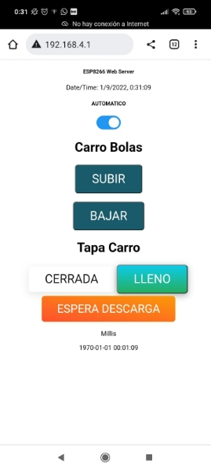


ENGLISH  (tambien en **español**) 

Objective: to control and monitor by means of an ESP8266 board programmed in Arduino (.ino) language a small agro-industrial process. In other words, an open source programmable automaton.

The application must be usable from any device with WiFi and browser (preferably Chrome). 

Once installed on the ESP8266 using the Arduino IDE (requires the installation of external libraries and **PATIENCE**) 

It is recommended to open the serial monitor in the Arduino IDE to view the registers.

ESP8266 will start to generate a WiFi connection, you must connect to the WiFi network that generates it, then navigate to the service address,

` `window will appear:

The application shows a timer under the screen, to know if the connection is in real time, also inside the JS-arduino code combination there are multithreads. 

The associated pins are as follows:
// Assign output variables to GPIO pins

const int PIN\_RISE\_5 = 5;

const int PIN\_BAJAR\_4 = 4;

const int LED\_BUILTIN\_16 = 16;

const int PIN\_INPUT\_TAPA\_12 = 12;

const int PIN\_INPUT\_CARRO\_14 = 14;

The index\_html.hpp file contains the HTML-JS and the web page. Ignore the code associated with the // MAPS FUNTIONS tag (I wanted to detect where the agricultural product fell). 

Video example of use: [https://www.youtube.com/shorts/0RRijg92TqM ](https://www.youtube.com/shorts/0RRijg92TqM)

ESPAÑOL

Objetivo: controlar y monitorizar mediante una placa ESP8266 programada en lenguaje Arduino (.ino) un pequeño proceso industrias agrario. Es decir, un autómata programable de código abierto.

La aplicación debe ser usable desde cualquier dispositivo con WiFi y navegador (preferentemente en Chrome) 

Una vez instalada en la ESP8266 mediante el IDE Arduino (requiere la instalación de librerías externas y **PACIENCIA**) 

Se recomienda abrir el monitor serie en el IDE de Arduino para ver los registros.

ESP8266 empezara a generar una conexión WiFi, se debe conectar a la red WiFi que genera la misma, ahí navegar a la dirección de servicio,

` `aparecerá la ventana:

La aplicación muestra un cronometro debajo de la pantalla, para saber si esta la conexión en tiempo real, también dentro de la combinación de código JS-arduino hay multi hilos 

Los pines asociados son los siguientes:
// Assign output variables to GPIO pins

const int PIN\_SUBIR\_5 = 5;

const int PIN\_BAJAR\_4 = 4;

const int LED\_BUILTIN\_16 = 16;

const int PIN\_INPUT\_TAPA\_12 = 12;

const int PIN\_INPUT\_CARRO\_14 = 14;

En el fichero index\_html.hpp se encuentra el HTML-JS y la página web. Ignorar el código asociado con la etiqueta // MAPS FUNTIONS (quería detectar donde cayó el producto agrícola) 

Video de ejemplo de uso: <https://www.youtube.com/shorts/0RRijg92TqM> 

")
